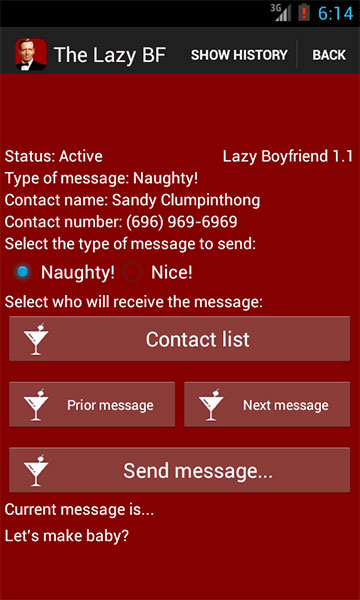

It was a fantastic Summer evening.  I was perched atop my favorite floaty, paddling around mindlessly and trying my best not to spill my just mixed martini, when suddenly, out of the blue, a splash!  My girlfriend was in the pool!

Later, after things had settled down and I was drifting off to sleep, she whispered in my ear, "Mark, how come you don't send me all those sexy messages like you used to when we first started dating?"  And you know what?  She was right!

I had to get back into her good graces somehow. I needed to make a grand gesture of sorts.  And I knew just what to do...

"You know what doll? *I'm going to make an app for that!*"
  
# [The Lazy Boyfriend](https://play.google.com/store/apps/details?id=com.thelazyboyfriend.app&hl=en)
#### *The* Android App for the ages...

#### ...but it's *not* for any of the following...

- kiddos
- the too feint of heart
- my grandma (unless you're my grandpa)
- anyone with a fragile sense or humor coupled with an unhealthy determination to self-identify as an aggrieved victim without merit

#### Enjoy!

